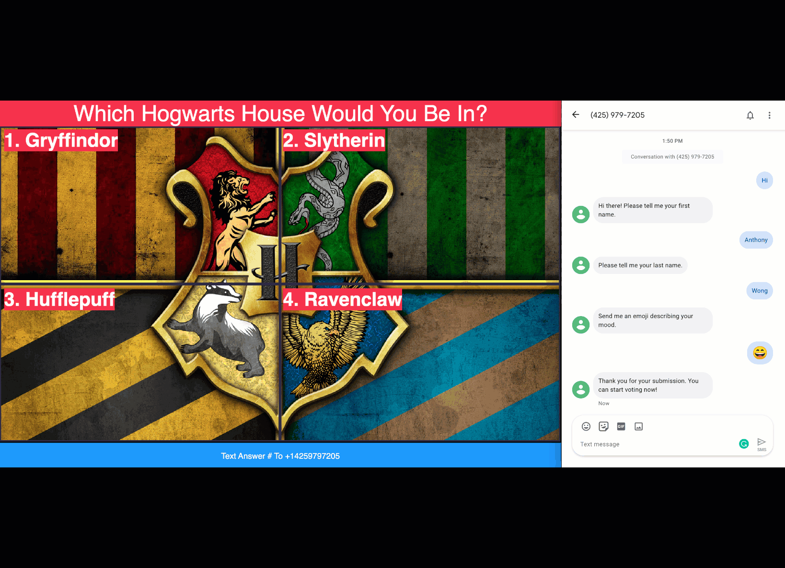

**Please note that this project is highly unstable.**

**It was a weekend hackathon project.**

**Needs to be rewritten with a front-end framework.**

# Twilio-SMS-Trivia



## Prerequisite

Before you can get started you will need the following:
- [Twilio Project](https://www.twilio.com/try-twilio)
- [Twilio Phone Number](https://support.twilio.com/hc/en-us/articles/223135247-How-to-Search-for-and-Buy-a-Twilio-Phone-Number-from-Console)
- [Twilio CLI](https://github.com/twilio/twilio-cli)
- [Twilio CLI Plugin: Serverless](https://github.com/twilio-labs/plugin-serverless)

### Deploy Autopilot

In ./twilio/autopilot execute the following command:

```sh
twilio autopilot:create
```

### Deploy Serverless

In ./twilio/serverless execute the following command:

```sh
twilio serverless:promote
```

Take a note of the Twilio Serverless Domain. You will need this later.

### Deploy Studio

In ./twilio/studio execute the following command:

```sh
twilio api:studio:v2:flows:create -p Twilio-SMS-Trivia --definition "`cat Trivia-Flow.json`" --friendly-name Trivia-Flow --status draft
```

### Edit Step

In Studio flow change the urls to be the following:

| Widget Name     | Function                      |
|-----------------|-------------------------------|
| fetchPlayerInfo | /twilio/sync/map/item/fetch   |
| getQuestion     | /twilio/sync/document/fetch   |
| validateVote    | /trivia/studio/validateVote   |
| saveVote        | /twilio/sync/list/item/insert |

In Serverless add the following .env

| KEY                     	| VALUE                               	|
|-------------------------	|-------------------------------------	|
| TWILIO_SYNC_SERVICE_SID 	| ISXXXXXXXXXXXXXXXXXXXXXXXXXXXXXXXXX 	|
| TWILIO_SYNC_API_KEY     	| SKXXXXXXXXXXXXXXXXXXXXXXXXXXXXXXXXX 	|
| TWILIO_SYNC_API_SECRET  	| XXXXXXXXXXXXXXXXXXXXXXXXXXX         	|

In Autopilot replace the `placeholderTwilioFunctions` with your Twilio Serverless Domain.

#### Modify Code

After deploying all the code you will need to modify the following lines:

| File Name                                     | Line | Template                        |
|-----------------------------------------------|------|---------------------------------|
| twilio/serverless/assets/js/twilio-handler.js | 121  | INSERT TWILIO SERVERLESS DOMAIN |
| twilio/serverless/assets/index.html           | 115  | INSERT TWILIO PHONE NUMBER      |
| twilio/serverless/assets/home.html            | 22   | INSERT TWILIO PHONE NUMBER      |
| twilio/serverless/assets/home.html            | 86   | INSERT TWILIO SERVERLESS DOMAIN |