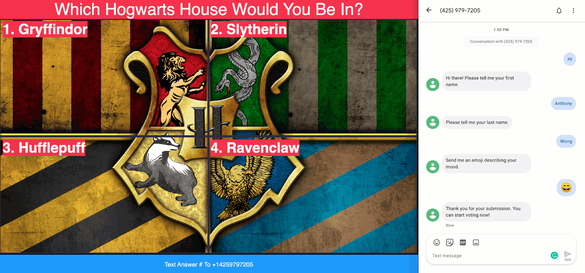

** Please note that this project is highly unstable.

** It was a weekend hackathon project.

** Needs to be rewritten in React.js

# Twilio-SMS-Trivia



## Setup


### Deploy Autopilot

In the twilio/autopilot execute the following command

```sh
twilio autopilot:create
```

### Deploy Serverless

In the twilio/serverless execute the following command

```sh
twilio serverless:promote
```

Take a note of the Twilio Serverless Domain. You will need this later.

### Deploy Studio

```sh

```

### Edit Step

In Studio flow change the urls to be the following:

| Widget Name     | Function                      |
|-----------------|-------------------------------|
| fetchPlayerInfo | /twilio/sync/map/item/fetch   |
| getQuestion     | /twilio/sync/document/fetch   |
| validateVote    | /trivia/studio/validateVote   |
| saveVote        | /twilio/sync/list/item/insert |

In Serverless add the following .env

| KEY                     	| VALUE                               	|
|-------------------------	|-------------------------------------	|
| TWILIO_SYNC_SERVICE_SID 	| ISXXXXXXXXXXXXXXXXXXXXXXXXXXXXXXXXX 	|
| TWILIO_SYNC_API_KEY     	| SKXXXXXXXXXXXXXXXXXXXXXXXXXXXXXXXXX 	|
| TWILIO_SYNC_API_SECRET  	| XXXXXXXXXXXXXXXXXXXXXXXXXXX         	|

#### Modify Code


| File Name                                     | Line | Template                            |
|-----------------------------------------------|------|-------------------------------------|
| twilio/serverless/assets/js/twilio-handler.js | 121  | <<INSERT TWILIO SERVERLESS DOMAIN>> |
| twilio/serverless/assets/index.html           | 115  | <<INSERT TWILIO PHONE NUMBER>>      |
| twilio/serverless/assets/home.html            | 22   | <<INSERT TWILIO PHONE NUMBER>>      |
| twilio/serverless/assets/home.html            | 86   | <<INSERT TWILIO SERVERLESS DOMAIN>> |